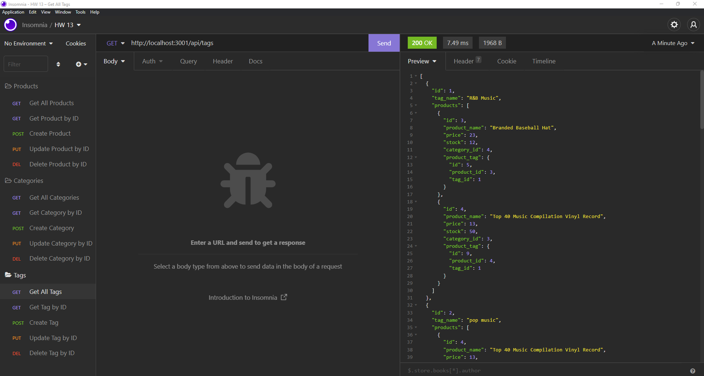

# Seans-SuperStoreSystem

## Description
This is a back end for an e-commerce site. It connects to a database and allows the user to view, create, update, and delete categories, products, and tags for their e-commerce store.

## Usage
The program is used by making calls on the API. These calls either pull, create, update, or delete data from the database. The user interacts with the program by using the command line and following the prompts.

## Technologies Used
This projected utilizes Express, Sequelize, and MySQL2

## Visual

## Contributions
Sean Duiser
sean.duiser.develop@gmail.com

## Deployed Link (Links to videos of functioning program)
[Products](https://drive.google.com/file/d/1DUTp2QG8sz4fiiRaaTjd_oYw_LFDgAH8/view)\
[Categories](https://drive.google.com/file/d/1hlC6b0wmsmIO9wVKzHaCxxqGrLv2cYgj/view)\
[Tags](https://drive.google.com/file/d/1E6ToNff590TO01ccnmu_5xcQ9FS2MvB7/view)

